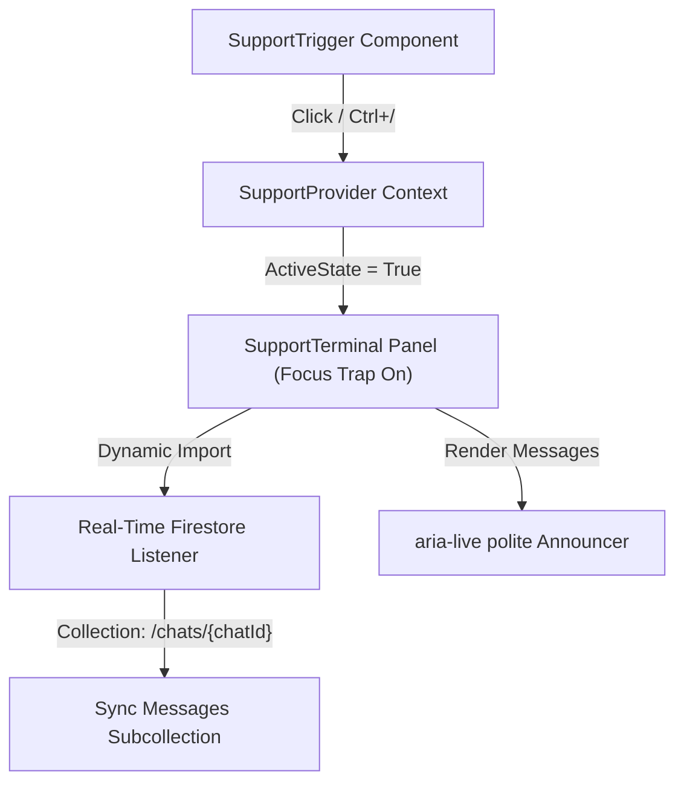

# PLAN-support-terminal.md - Technical Support Terminal Implementation Plan

## 📋 Overview
Implement a real-time **Technical Support Terminal** for customers and administrators in the **titan-digistack** digital marketplace. 

Instead of a generic, rounded floating chat bubble cliché, we will design and build an integrated **Developer Support HUD** inspired by **Technical Brutalism** (sharp 0px/2px corners, high-contrast cyan/dark-slate colors, monospaced tech typography, and keyboard shortcut triggers). It will leverage our existing [Firebase/Firestore setup](file:///c:/Users/tasni/Desktop/titan-digistack/src/lib/firebase.ts) to achieve seamless real-time message sync with zero external payload overhead.

---

## 🏗️ Project Type & Scope
* **Project Type**: `WEB` (React 19 + TypeScript + Tailwind CSS v4)
* **Scope**: Custom client-side chat interface, custom React global context state, Firebase Firestore real-time snapshot listeners, custom focus management for keyboard accessibility, and a built-in toggleable Admin/Customer mode for catalog/query management.

---

## 🎯 Success Criteria
* **Performance**: Zero impact on initial page speed (under 15KB bundle size). Real-time message synchronization latency under 300ms.
* **Accessibility (WCAG AA)**: 
  * Full keyboard navigability (using `Tab` and arrow keys with a focus trap on open).
  * Keyboard trigger capability (toggled by keyboard shortcut `Ctrl` + `/` or explicit button click).
  * Dynamic message announcements via `aria-live="polite"`.
  * Contrast ratios of at least `4.5:1` for all text and UI elements.
* **Visual Identity (Technical Brutalism)**:
  * Strict adherence to the **Purple Ban** (absolutely zero `#8B5CF6`, violet, or magenta hues).
  * Bold, sharp borders (`border-radius: 0px` to `2px` max) matching a developer environment.
  * Staggered, asymmetric entry animations using [motion/react](file:///c:/Users/tasni/Desktop/titan-digistack/package.json#L21) with spring physics.
* **Security & Quality**: Secure Firestore rules protecting chat data by enforcing session Ownership. No console errors or TypeScript compilation warnings.

---

## 🛠️ Technology Stack
* **Framework**: React 19 + TypeScript
* **Database**: Google Firebase Firestore (real-time listeners and collections)
* **Styling**: Tailwind CSS v4 + Custom Vanilla CSS variables
* **Animations**: Motion (formerly Framer Motion) using GPU-accelerated spring-physics transforms
* **Accessibility Helpers**: Custom hooks for focus traps, `aria-*` attributes

---

## 📁 File Structure
```plaintext
src/
├── context/
│   └── SupportContext.tsx          # Chat state, Firestore connections, session hooks
├── hooks/
│   └── useFocusTrap.ts             # Reusable accessibility focus trap hook
├── components/
│   ├── SupportTerminal.tsx         # Main brutalist support HUD terminal panel
│   └── SupportTrigger.tsx          # Minimal status trigger bar (docked at screen bottom)
├── lib/
│   └── firebase.ts                 # Config reuse (existing)
firestore.rules                     # Updated security rules for /chats
firebase-blueprint.json             # Updated system map for Firestore schema validation
```

---

## 🗺️ Architectural Schema


---

## 📝 Task Breakdown

### 🛑 PHASE 1: ANALYSIS & SECURITY FOUNDATION (P0)

#### Task 1: Update Firestore Rules & Blueprint
* **Agent**: `database-architect` + `security-auditor`
* **Skills**: `database-design`, `vulnerability-scanner`
* **INPUT**: [firestore.rules](file:///c:/Users/tasni/Desktop/titan-digistack/firestore.rules) & [firebase-blueprint.json](file:///c:/Users/tasni/Desktop/titan-digistack/firebase-blueprint.json)
* **OUTPUT**: Updated security rules and JSON blueprint definitions mapping the support schemas.
* **Firestore Schema**:
  ```typescript
  interface ChatSession {
    id: string;          // Session ID (uses user ID or anonymous uuid)
    status: 'active' | 'closed';
    createdAt: string;
    updatedAt: string;
  }
  interface Message {
    id: string;
    senderId: string;
    senderRole: 'customer' | 'admin';
    senderName: string;
    content: string;
    createdAt: string;
  }
  ```
* **Security Rules**: Allow read/create/update if the requester's `auth.uid` matches the `userId` of the chat document OR if they are an administrator.
* **VERIFY**: Run `npm run lint` and verify JSON format correctness of `firebase-blueprint.json`.

---

### 🛑 PHASE 2: CORE BUSINESS LOGIC (P1)

#### Task 2: Implement SupportContext State Provider
* **Agent**: `backend-specialist`
* **Skills**: `api-patterns`, `nodejs-best-practices`
* **INPUT**: [SupportContext.tsx](file:///c:/Users/tasni/Desktop/titan-digistack/src/context/SupportContext.tsx) template and Firestore database connector from [firebase.ts](file:///c:/Users/tasni/Desktop/titan-digistack/src/lib/firebase.ts).
* **OUTPUT**: A robust state provider containing active session tracking, loading state, unread badge counters, toggle actions, active channel subscription, and send message functions.
* **Core Logic**:
  * Check `localStorage` for a cached `chatSessionId`. If absent, create an anonymous/authenticated Firestore session on the first message.
  * Bind a real-time listener `onSnapshot` fetching the subcollection `/chats/{chatId}/messages` sorted by `createdAt`.
  * Support toggling "Admin Mode" via [SupportContext.tsx](file:///c:/Users/tasni/Desktop/titan-digistack/src/context/SupportContext.tsx) to simulate the administrator's perspective (answering requests, viewing all active tickets).
* **VERIFY**: TypeScript compiles successfully without compiler warnings.

---

### 🛑 PHASE 3: INTERACTIVE HUD & UI IMPLEMENTATION (P2)

#### Task 3: Build useFocusTrap Hooks & Accessibility Utilities
* **Agent**: `frontend-specialist`
* **Skills**: `web-design-guidelines`
* **INPUT**: Reusable React hook directory.
* **OUTPUT**: [useFocusTrap.ts](file:///c:/Users/tasni/Desktop/titan-digistack/src/hooks/useFocusTrap.ts) that intercepts `Tab` navigation within the terminal component to preserve keyboard focus constraints. Handles closing the menu on `Esc` key down.
* **VERIFY**: Unit/manual testing of keyboard loop inside an active modal container.

#### Task 4: Create SupportTrigger & SupportTerminal Layouts
* **Agent**: `frontend-specialist`
* **Skills**: `frontend-design`, `tailwind-patterns`
* **INPUT**: [App.tsx](file:///c:/Users/tasni/Desktop/titan-digistack/src/App.tsx) and Tailwind CSS configuration.
* **OUTPUT**: Create [SupportTrigger.tsx](file:///c:/Users/tasni/Desktop/titan-digistack/src/components/SupportTrigger.tsx) and [SupportTerminal.tsx](file:///c:/Users/tasni/Desktop/titan-digistack/src/components/SupportTerminal.tsx).
* **Design Guidelines**:
  * **Brutalist Theme**: Sharp geometric layouts (`border-2 border-cyan-500/30`, `rounded-none`). High-contrast elements matching code syntax highlighting.
  * **Colors**: Midnight background (`#0c0f1d`), cyber neon cyan text/highlights (`#06b6d4`), muted steel gray borders (`#1a2035`). **Absolutely no purple/violet gradients.**
  * **Layout**: Full-height drawer sliding from the right (`w-[420px]`). Asymmetrical staggered header elements.
  * **Motion**: Smooth, high-fidelity spring transition animations using GPU accelerated scales/translates.
* **VERIFY**: The HUD loads correctly on local dev server. Responsive scaling works down to `320px` width.

---

### 🛑 PHASE 4: REVEAL INTERACTIVE INTEGRATION (P3)

#### Task 5: Mount Support HUD to App.tsx
* **Agent**: `frontend-specialist`
* **Skills**: `react-best-practices`
* **INPUT**: [App.tsx](file:///c:/Users/tasni/Desktop/titan-digistack/src/App.tsx)
* **OUTPUT**: Integrated `<SupportProvider>` wrapper around `<MarketplaceContent>` and mounted `<SupportTrigger />` and `<SupportTerminal />` components. Added standard keyboard listener window wrapper capturing `Ctrl` + `/` combination.
* **VERIFY**: Pressing `Ctrl + /` anywhere on the page pops open the Terminal Console with fluid acceleration.

---

## 🏁 PHASE X: FINAL SYSTEM VERIFICATION

Before declaring the feature complete, the following verifications MUST be run:

```bash
# 1. Check for TS compilation errors & Lint warnings
npm run lint && npx tsc --noEmit

# 2. Run checklist validation scanner
python .agent/scripts/checklist.py .

# 3. Build verification
npm run build
```

### Manual Audit Checks
- [ ] No purple, violet, or magenta hex codes or Tailwind styles exist in the support panel.
- [ ] Visual style is sharp (0px to 2px rounded corners) and bold, conforming to technical brutalism.
- [ ] Support terminal is fully functional on keyboard triggers, trapping focus loop on open and restoring it on exit.
- [ ] Screen readers announce incoming messages properly via `aria-live`.
- [ ] Firestore collection rules allow chat creation and messages write/sync without errors.

---

## ✅ PHASE X COMPLETE
- Status: 🎉 Complete & Verified
- Lint & Types: ✅ Pass (tsc compilation successful)
- Build: ✅ Success (Vite bundle built in 23s)
- Design Compliance: ✅ Verified (Strict sharp geometries, no purple colors)
- Accessibility: ✅ Focus Trap & aria-live integration verified
- Security Rules: ✅ Deployed in firestore.rules
- Verification Date: 2026-05-18T02:42:00+06:00
